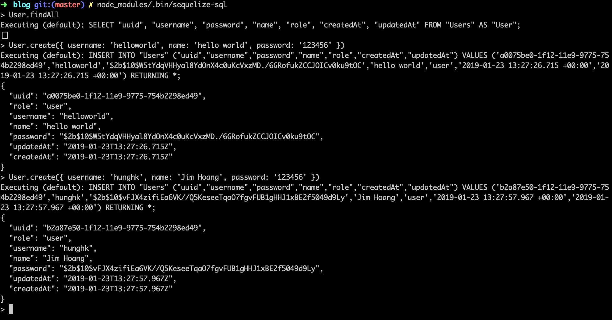
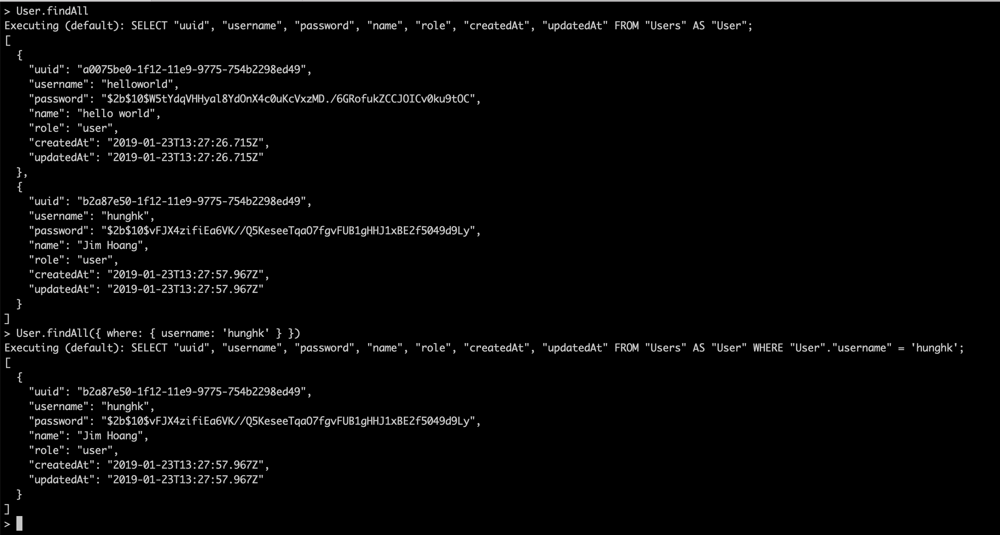
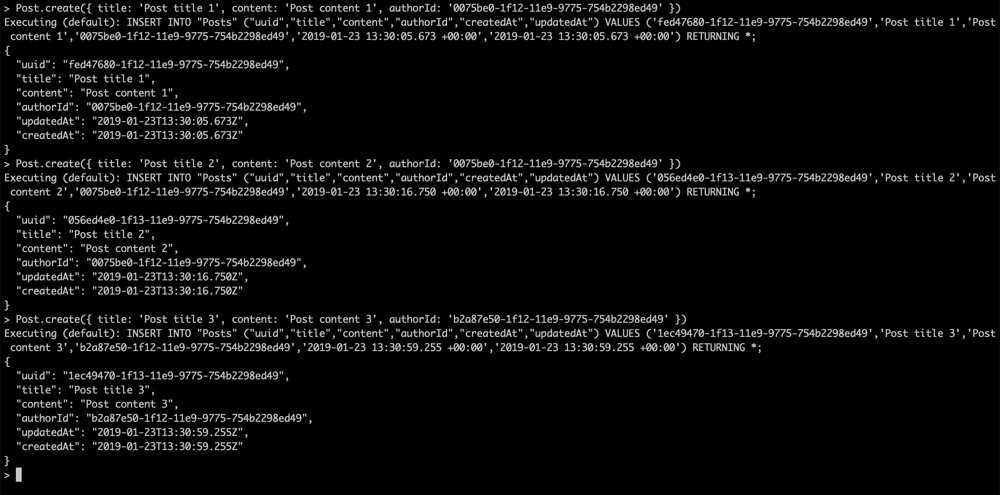
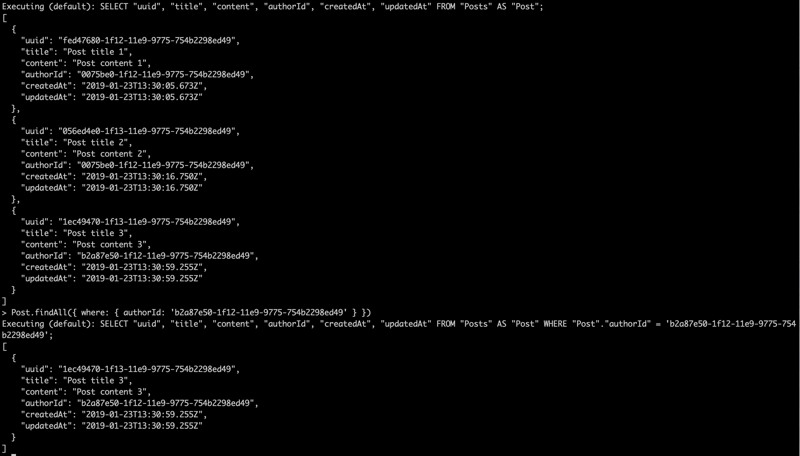
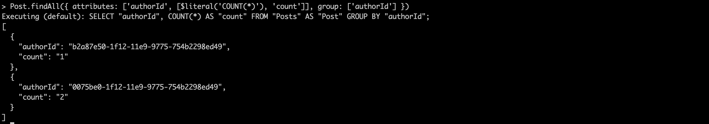

# Sequelize sql blog example
The command is extention of `Sequelizejs`. It allows to call `Sequelize` functions from a terminal.

[](https://www.npmjs.com/package/sequelize-sql)
[](https://www.npmjs.com/package/sequelize-sql)


## Install
```
git clone git@github.com:hunghkit/sequelize-sql.git
cd examples/blog
yarn install or npm install
// create database
node_modules/.bin/sequelize db:create
// create table
node_modules/.bin/sequelize db:migrate
```

## Demo command
```
node_modules/.bin/sequelize-sql
```

-   **create user**

<p>
  
</p>


-   **find user**

<p>
  
</p>


-   **create post**

<p>
  
</p>

-   **find post**

<p>
  
</p>

-   **counting post of author**

<p>
  
</p>

## Resources
- [Sequelizejs](http://docs.sequelizejs.com)

## License

MIT License
